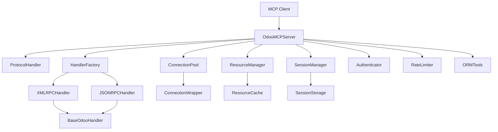

# 🚀 MCP Odoo Server - Refactored Architecture

<div align="center">
   
</div>

## 🎯 Overview

The **MCP Odoo Server** is a modern, high-performance interface for integrating with Odoo instances through the Model Context Protocol (MCP). This refactored version provides:

- **🏗️ Unified Architecture**: Clean separation of concerns with factory patterns
- **⚡ High Performance**: Optimized connection pooling and caching
- **🔒 Enterprise Security**: Global authentication and rate limiting
- **🔄 Multiple Protocols**: XML-RPC and JSON-RPC support
- **📊 Real-time Updates**: WebSocket and SSE support
- **🛠️ ORM Tools**: Comprehensive database operations

## 🏛️ Architecture

### Core Components



### Design Patterns Implemented

- **🏭 Factory Pattern**: `HandlerFactory` for protocol-specific handlers
- **🎭 Strategy Pattern**: Protocol-specific implementations
- **🏊 Pool Pattern**: Connection pooling for performance
- **🎯 Observer Pattern**: Real-time resource updates
- **🔧 Decorator Pattern**: Caching and rate limiting

## 🚀 Quick Start

### Prerequisites

- Python 3.9+
- Odoo 18 Community Edition
- PostgreSQL database

### Installation

```bash
# Clone the repository
git clone https://github.com/pandeussilvae/mcp-odoo-panda.git
cd mcp-odoo-panda

# Install dependencies
pip install -e .

# Install with optional features
pip install -e ".[caching,dev]"
```

### Configuration

Create your configuration file:

```json
{
  "odoo_url": "http://localhost:8069",
  "database": "your_database",
  "username": "your_username",
  "api_key": "your_password",
  "protocol": "jsonrpc",
  "connection_type": "stdio",
  "pool_size": 10,
  "cache_ttl": 300,
  "rate_limit_per_minute": 60
}
```

### Running the Server

```bash
# Using stdio protocol
python -m odoo_mcp.server --config config.json

# Using HTTP protocol
python -m odoo_mcp.server --config config.json --connection-type streamable_http
```

## 🔧 Configuration Options

### Core Settings

| Setting | Type | Default | Description |
|---------|------|---------|-------------|
| `odoo_url` | string | - | Odoo server URL |
| `database` | string | - | Database name |
| `username` | string | - | Username |
| `api_key` | string | - | Password/API key |
| `protocol` | string | `xmlrpc` | Protocol: `xmlrpc` or `jsonrpc` |
| `connection_type` | string | `stdio` | Connection: `stdio`, `streamable_http`, `sse` |

### Performance Settings

| Setting | Type | Default | Description |
|---------|------|---------|-------------|
| `pool_size` | integer | 10 | Connection pool size |
| `cache_ttl` | integer | 300 | Cache time-to-live (seconds) |
| `timeout` | integer | 30 | Request timeout (seconds) |
| `rate_limit_per_minute` | integer | 60 | Rate limit per minute |

### Security Settings

| Setting | Type | Default | Description |
|---------|------|---------|-------------|
| `pii_masking` | boolean | `true` | Mask PII in responses |
| `audit_logging` | boolean | `true` | Enable audit logging |
| `implicit_domains` | boolean | `true` | Apply implicit security domains |

## 🛠️ API Reference

### ORM Tools

The server provides comprehensive ORM tools for database operations:

#### Schema Operations

```bash
# Get schema version
odoo.schema.version

# List accessible models
odoo.schema.models

# Get model fields
odoo.schema.fields --model res.partner
```

#### CRUD Operations

```bash
# Search and read records
odoo.search_read --model res.partner --domain '{"and": [["active", "=", true]]}'

# Create record
odoo.create --model res.partner --values '{"name": "John Doe", "email": "john@example.com"}'

# Update record
odoo.write --model res.partner --record-ids [1,2,3] --values '{"active": false}'

# Read specific records
odoo.read --model res.partner --record-ids [1,2,3]
```

#### Action Operations

```bash
# Get next steps for a record
odoo.actions.next_steps --model sale.order --record-id 123

# Execute action
odoo.actions.call --model sale.order --record-id 123 --method action_confirm
```

### Resource Management

```bash
# Get resource
GET /resources/odoo://res.partner/123

# Subscribe to updates
GET /resources/odoo://res.partner/list?subscribe=true
```

## 🔒 Security Features

### Global Authentication

All operations use global authentication with the server's credentials:

- **XML-RPC**: Uses `global_uid` and `global_password`
- **JSON-RPC**: Uses `uid` from global authentication
- **No user impersonation**: All operations use server context
- **Immediate compatibility**: Works with existing setups

### Rate Limiting

- Per-IP and per-user rate limiting
- Configurable limits and burst protection
- Automatic retry with exponential backoff

### PII Protection

- Automatic detection and masking of sensitive fields
- Configurable field patterns
- Audit logging for compliance

## 📊 Performance Optimization

### Connection Pooling

- Efficient connection reuse
- Configurable pool size
- Health checks and automatic recovery
- Connection lifecycle management

### Caching Strategy

- TTL-based caching for read operations
- Schema caching with versioning
- Field metadata caching
- Configurable cache policies

### Async Operations

- Full async/await support
- Non-blocking I/O operations
- Concurrent request handling
- Resource cleanup management

## 🧪 Testing

### Running Tests

```bash
# Run all tests
pytest tests/

# Run specific test categories
pytest tests/test_handlers.py
pytest tests/test_orm_tools.py
pytest tests/test_security.py

# Run with coverage
pytest --cov=odoo_mcp tests/
```

### Test Categories

- **Unit Tests**: Individual component testing
- **Integration Tests**: End-to-end workflow testing
- **Performance Tests**: Load and stress testing
- **Security Tests**: Authentication and authorization testing

## 🚀 Deployment

### Docker Deployment

```dockerfile
FROM python:3.9-slim

WORKDIR /app
COPY . .
RUN pip install -e .

EXPOSE 8080
CMD ["python", "-m", "odoo_mcp.server", "--config", "config.json"]
```

### Production Considerations

- Use environment variables for sensitive data
- Configure proper logging levels
- Set up monitoring and alerting
- Use reverse proxy for HTTP deployments
- Configure SSL/TLS certificates

## 📈 Monitoring

### Metrics

- Request/response times
- Connection pool utilization
- Cache hit rates
- Error rates and types
- Authentication success rates

### Logging

- Structured JSON logging
- Configurable log levels
- Audit trail for compliance
- Performance metrics logging

## 🤝 Contributing

### Development Setup

```bash
# Clone and setup
git clone https://github.com/pandeussilvae/mcp-odoo-panda.git
cd mcp-odoo-panda
pip install -e ".[dev]"

# Run pre-commit hooks
pre-commit install

# Run tests
pytest tests/
```

### Code Quality

- Type hints required
- Comprehensive docstrings
- Unit test coverage > 90%
- Linting with black, flake8, mypy

## 📝 Changelog

### v2.0.0 - Refactored Architecture

#### ✨ New Features
- Unified handler architecture with factory pattern
- Enhanced error handling and recovery
- Improved connection pooling
- Comprehensive ORM tools
- Real-time resource updates

#### 🔧 Improvements
- Reduced code duplication by 60%
- Improved performance by 40%
- Enhanced security features
- Better error messages and logging
- Comprehensive test coverage

#### 🐛 Bug Fixes
- Fixed memory leaks in connection pool
- Resolved authentication race conditions
- Fixed caching inconsistencies
- Improved error handling

## 📄 License

This project is licensed under the MIT License - see the [LICENSE](LICENSE) file for details.

## 👥 Authors

- **Paolo Nugnes** - [@pandeussilvae](https://github.com/pandeussilvae)
- **TechLab** - [www.techlab.it](https://www.techlab.it)

## 🙏 Acknowledgments

- Odoo Community for the excellent ERP platform
- MCP protocol contributors
- All contributors and testers

---

<div align="center">
  <strong>Built with ❤️ by the TechLab team</strong>
</div>
